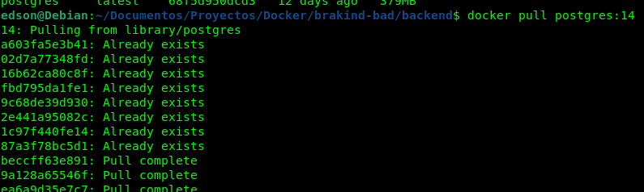
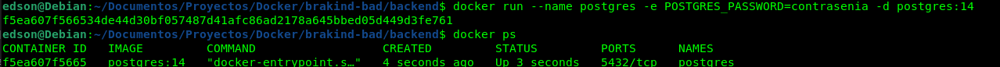
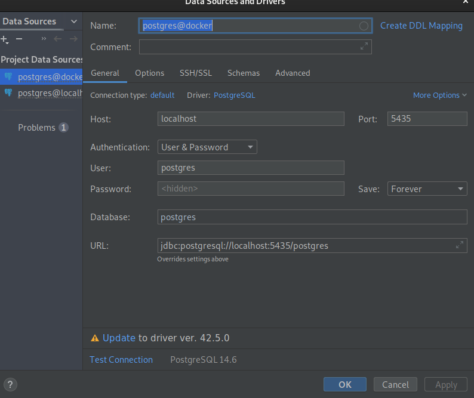
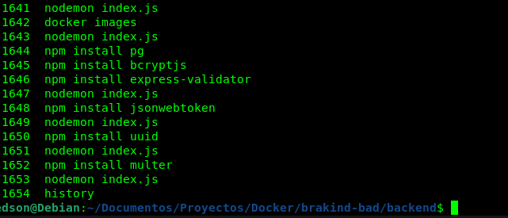
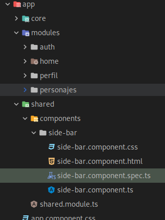

Hola Buenas noches 

//Base de Datos
1 Primeramente saludarlo y aclarar que por error Creee la Base de datos en PostgreSql
2.Para Crear mi servidor de base de datos use docker con el comando 
  docker pull protgres:14

3. una ves descargada la imagen cree mi contenenedo

docker run -p 5435:5432 --name postgresdoker -e POSTGRES_PASSWORD=contrasenia -d postgres:14

4. Posteriormente me conecte desde DataGrip

5. Lugo cree el schema core en el cual cree la tabla usuario
create table core.usuario
   (
   id_usuario      bigserial   not null,
   nombre          VARCHAR(200),
   nickname        varchar(100),
   email           varchar(100),
   contrasenia     varchar(300),
   estado_registro int4        not null default 1,
   usuario_reg     varchar(30) not null default "current_user"(),
   fecha_reg       timestamp   not null default now(),
   host_reg        varchar(30) not null default inet_client_addr(),
   usuario_mod     varchar(30) null,
   fecha_mod       timestamp   null,
   host_mod        varchar(30) null,
   CONSTRAINT id_usuario_pk primary key (id_usuario)
   );

//Backend
7. al inicializar el Backend
realize las instalaciones de 
Express, uuid, bcrypt, express-validatos,jsonwebtoken, cors, pg, dotenv

 Continua backend/README.md
//Front-end

8. Cre la aplicacion frontend
 instale bootstrap
cree los modulos de auth, personajes, perfil, shared

genere los guards, para que se valide token existen
Continua frontend/README.md
