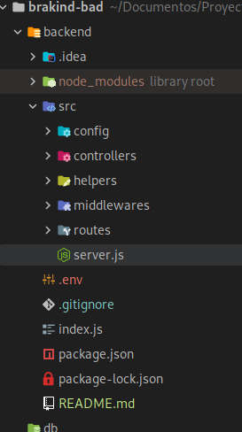
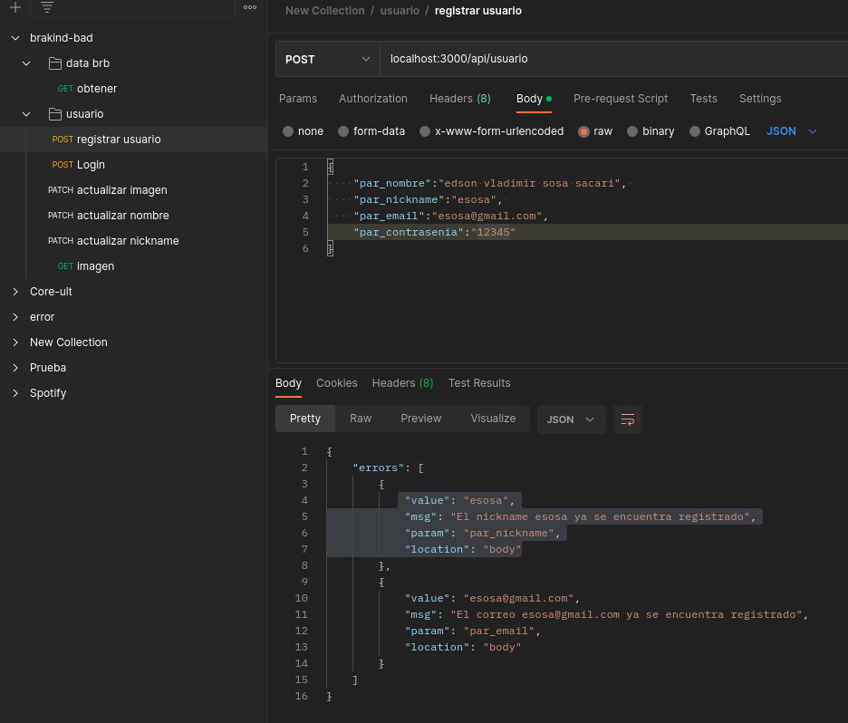

Correr la aplicacion
npm install 

node index

//Backend 
Diseño:
1.se genero las carpetas segun lo requerido validando cada una de las peticiones

2.gracias a los Helpers y midlewares se logro validar varios campos con la ayuda de express-validator

3. se uso Postman para probar las APIS Archivo destro de Utils

