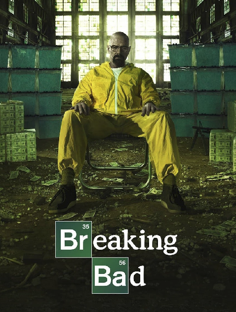
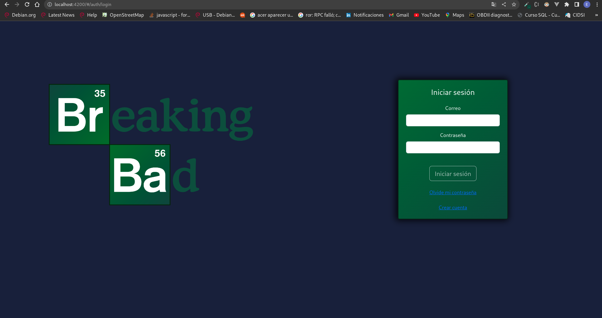
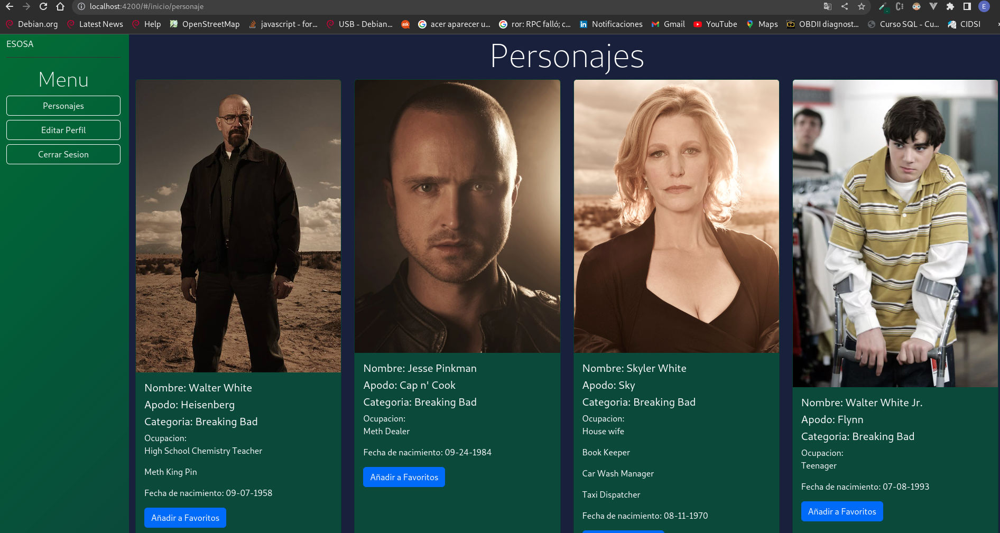
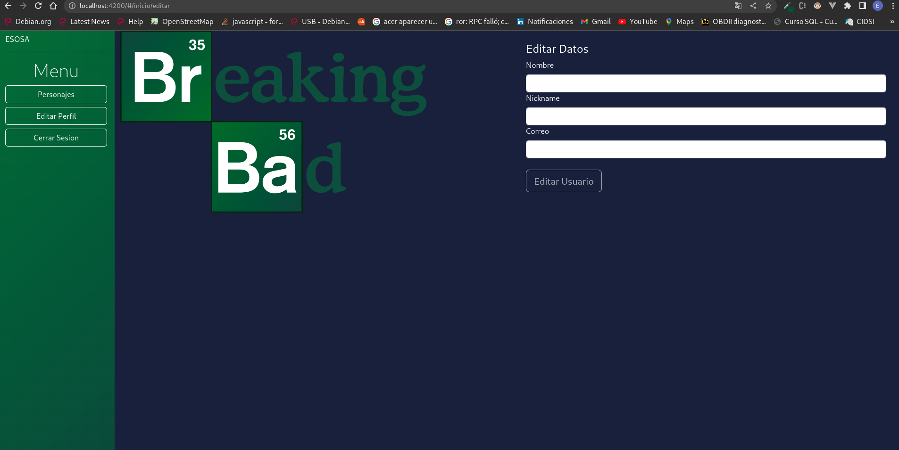

# Frontend
//inicializar aplicacion
1. npm install;
2. ng serve
//Diseño
Se realizo el diseño de acuerdo a los colores de lña serie y de los distintas imagenes 
encontradas en internet por 
Ejemplo

Resultado:

Con la ayuda de Bootstrap y CSS se logro obtener el resultado
